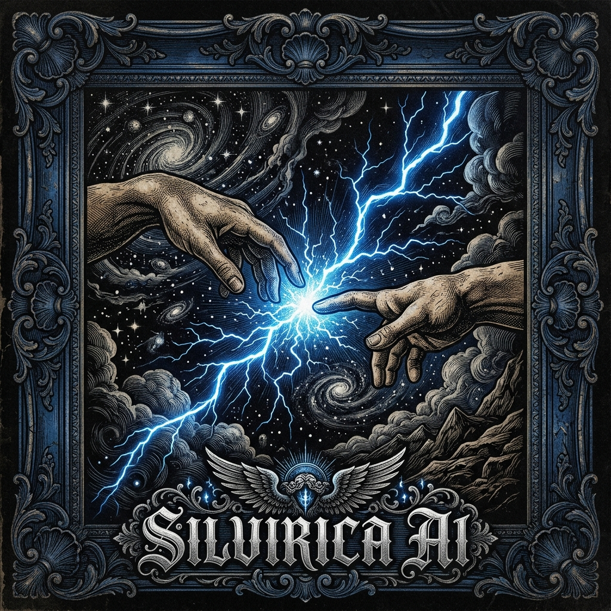

# SILVIRICA AI

<div align="center">


### Universal AI Intelligence Enhancement Runtime
**Low-Token • Ultra-Fast • Multi-IDE • Multi-Agent • Knowledge Graph • Obsidian Memory • 142 Skills • Zero-Token Path**

[](LICENSE)
[](https://www.python.org/)
[](https://modelcontextprotocol.io)
[](#-skill-system-142-specialized-skills)
[](#-key-value-propositions)
[](#-instant-one-line-installation)

[English](README.md) • [日本語](README.ja.md) • [한국어](README.ko.md) • [中文](README.zh.md)

</div>

---

<div align="center">

</div>

---

## ⚡ What is Silvirica AI?

Silvirica AI is **NOT** another foundation model.

Silvirica AI is an intelligent operating layer and runtime installed between your **IDE / Coding Assistant** and **AI Foundation Models**. It eliminates blind prompt bloat, intercepts questions that can be solved deterministically with **zero tokens**, injects surgical symbols and graph context, maintains an Obsidian-style markdown memory vault, and progressively activates 142 specialized skills on demand.

```
                  ┌──────────────────────────────────────────────┐
                  │             USER / DEVELOPER                 │
                  └──────────────────────┬───────────────────────┘
                                         │
                                         ▼
                  ┌──────────────────────────────────────────────┐
                  │          IDE / AI CODING ASSISTANT           │
                  │   (Cursor, Antigravity, Claude, VS Code)    │
                  └──────────────────────┬───────────────────────┘
                                         │
                                         ▼
┌─────────────────────────────────────────────────────────────────────────────┐
│                             SILVIRICA RUNTIME                               │
│                                                                             │
│  ┌───────────────────────┐  ┌─────────────────────────┐  ┌───────────────┐  │
│  │ FastGate & Zero-Model │  │ AST Multi-Lang Parser   │  │ Model Router  │  │
│  │ (0 Tokens, <40ms)     │  │ (Python, JS, TS, PHP...) │  │ & Reason Budg │  │
│  └──────────┬────────────┘  └────────────┬────────────┘  └───────┬───────┘  │
│             │                            │                       │          │
│  ┌──────────▼────────────┐  ┌────────────▼────────────┐  ┌───────▼───────┐  │
│  │ SQLite Knowledge Graph│  │ Obsidian Memory Vault   │  │ 142 Skills    │  │
│  │ & Multi-Hop Pathways  │  │ (ADRs, Failures, Wiki)  │  │ (Level 0/1/2) │  │
│  └──────────┬────────────┘  └────────────┬────────────┘  └───────┬───────┘  │
│             │                            │                       │          │
│  ┌──────────▼────────────────────────────▼───────────────────────▼───────┐  │
│  │ Smart Context Compiler + Redaction + Token Budget Engine (~99% Saved) │  │
│  └───────────────────────────────────────┬───────────────────────────────┘  │
└──────────────────────────────────────────┼──────────────────────────────────┘
                                           │
                                           ▼
                  ┌──────────────────────────────────────────────┐
                  │                 AI MODEL(S)                  │
                  │   Quick • Coder • Architect • Deep Reasoning │
                  └──────────────────────────────────────────────┘
```

---

## 🚀 Instant One-Line Installation

### Windows (PowerShell)
```powershell
irm https://raw.githubusercontent.com/vinzz-yy/silvirica-ai/main/install.ps1 | iex
```

### Linux & macOS (Bash / Zsh)
```bash
curl -fsSL https://raw.githubusercontent.com/vinzz-yy/silvirica-ai/main/install.sh | bash
```

### Manual Installation (From Source)
```bash
git clone https://github.com/vinzz-yy/silvirica-ai.git
cd silvirica-ai
pip install -e .
```

---

## 💎 Key Value Propositions

| Feature | Without Silvirica AI | With Silvirica AI |
|---|---|---|
| **Token Consumption** | 20,000–80,000 tokens per prompt (full repo dumps) | **50–400 tokens** (Surgical AST extraction) |
| **Deterministic Questions** | Calls expensive LLMs (costs $0.05–$0.20, takes 4–8s) | **Zero-Model Path (0 tokens, $0.00, <40ms)** |
| **Memory & Decisions** | Lost after chat session resets | **Persistent Obsidian-style Markdown Memory & ADRs** |
| **Project Awareness** | Blind text search / Hallucinated imports | **Multi-hop SQLite Knowledge Graph & Callers** |
| **Skill Injection** | Stuffing dozens of instructions into prompt | **Progressive 3-Tier Loading (Level 0/1/2)** |
| **Security & Secrets** | Secrets & API keys accidentally sent to LLM | **Automated local redaction & OWASP guardrails** |
| **Model Cost Routing** | 100% sent to flagship models ($$$) | **Smart Routing (Quick, Coder, Architect, Deep)** |

---

<div align="center">

</div>

---

## 🛠️ Complete CLI Command Reference

```bash
# Initialize brain in any codebase
silvirica init

# Run 16-point comprehensive runtime health diagnostics
silvirica doctor

# Query repository with Zero-Model resolver & Smart Context Compiler
silvirica ask "Where is ProjectBrain defined?"
silvirica ask "Audit permission boundary in AuthController"

# Explain routing and token optimization rationale
silvirica explain-last

# View real-time terminal Observatory telemetry dashboard
silvirica dashboard

# Run Naive vs. Silvirica token benchmark comparison
silvirica benchmark

# Inspect 142 progressive skills
silvirica skills

# Query SQLite dependency knowledge graph
silvirica graph "ProjectBrain"

# Run defensive vulnerability and credential scanner
silvirica security

# Audit design system tokens, typography, and CSS variables
silvirica uiux

# Start Model Context Protocol (MCP) server for IDEs
silvirica mcp

# Start local REST API daemon
silvirica daemon --port 8420
```

---

## 🔌 Universal MCP Server Configuration

Connect Silvirica AI seamlessly into **Cursor**, **Claude Desktop**, **Antigravity IDE**, **VS Code**, **Roo**, or **Cline**:

### `mcp_config.json` / `claude_desktop_config.json`
```json
{
  "mcpServers": {
    "silvirica": {
      "command": "silvirica",
      "args": ["mcp"]
    }
  }
}
```

### 14 Native MCP Tools Available:
1. `silvirica_project`: Auto-detect framework, languages, runtime, dependencies.
2. `silvirica_search`: Hybrid structural and lexical code search.
3. `silvirica_symbol`: Surgical symbol extraction (class, method, function signature).
4. `silvirica_graph`: Multi-hop dependency and caller graph traversal.
5. `silvirica_memory`: Obsidian markdown memory vault reader with wikilinks.
6. `silvirica_recall`: Fast ADR and failure memory retrieval.
7. `silvirica_skill`: Progressive skill instructions loader (Level 1 / Level 2).
8. `silvirica_security`: Defensive vulnerability and secret scanner.
9. `silvirica_context`: Smart Context Compiler (token budget packing + redaction).
10. `silvirica_route`: Model category selection & reasoning budget calculator.
11. `silvirica_impact`: Blast radius & multi-hop symbol change impact analyzer.
12. `silvirica_git`: Git diff & unstaged modification inspector.
13. `silvirica_stats`: Observatory telemetry, cache efficiency, and token metrics.
14. `silvirica_health`: Silvirica Doctor diagnostic health matrix.

---

<div align="center">

</div>

---

## 🧠 Skill System: 142 Specialized Skills

Silvirica AI comes packed with a comprehensive, modular suite of **142 progressive skills** across 8 specialized domains:

### 1. 🏗️ Architecture & System Design (22 Skills)
`sv-architecture`, `sv-api-design`, `sv-database-design`, `sv-domain-driven-design`, `sv-event-driven-architecture`, `sv-microservices-patterns`, `sv-distributed-systems`, `sv-cloud-native-design`, `sv-caching-strategies`, `sv-graphql-architect`, `sv-restful-api-patterns`, `sv-modular-monolith`, `sv-clean-architecture`, `sv-hexagonal-architecture`, `sv-cqrs-es`, `sv-concurrency-patterns`, `sv-adr-recorder`, `sv-schema-migration-guard`, `sv-resilience-patterns`, `sv-tenancy-isolation`, `sv-service-mesh`, `sv-high-throughput-pipelines`.

### 2. 🛡️ Security & Hardening (18 Skills)
`sv-security-audit`, `sv-secret-scanner`, `sv-owasp-top-10`, `sv-auth-guard`, `sv-rbac-authorization`, `sv-jwt-security`, `sv-csrf-xss-protection`, `sv-sql-injection-shield`, `sv-input-sanitizer`, `sv-rate-limiting`, `sv-cryptography-best-practices`, `sv-data-privacy-gdpr`, `sv-dependency-vulnerability-audit`, `sv-threat-modeling`, `sv-tls-cert-manager`, `sv-secure-headers`, `sv-container-security`, `sv-zero-trust-architecture`.

### 3. ⚡ Performance & Optimization (16 Skills)
`sv-performance`, `sv-query-optimizer`, `sv-latency-reduction`, `sv-memory-leak-hunter`, `sv-n-plus-one-detector`, `sv-token-cost-optimizer`, `sv-bundle-size-reducer`, `sv-core-web-vitals`, `sv-cache-invalidation`, `sv-concurrency-tuning`, `sv-profiler-analysis`, `sv-database-indexing-advisor`, `sv-network-overhead-reduction`, `sv-lazy-loading-patterns`, `sv-gpu-acceleration-patterns`, `sv-async-io-tuning`.

### 4. 🎨 Frontend, UI & Design Engineering (20 Skills)
`sv-ui-ux-pro`, `sv-accessibility-wcag`, `sv-apple-design`, `sv-design-system-foundations`, `sv-responsive-layouts`, `sv-micro-interactions`, `sv-tailwind-mastery`, `sv-css-grid-flexbox`, `sv-modern-typography`, `sv-color-palette-curator`, `sv-dark-mode-engine`, `sv-form-ux-validation`, `sv-animation-orchestration`, `sv-svg-canvas-graphics`, `sv-data-visualization`, `sv-component-composability`, `sv-state-management`, `sv-client-side-caching`, `sv-seo-foundations`, `sv-cross-browser-compatibility`.

### 5. 🧪 Testing & Quality Assurance (18 Skills)
`sv-testing`, `sv-tdd-practitioner`, `sv-adversarial-qa`, `sv-integration-test-suite`, `sv-e2e-playwright`, `sv-mock-stub-fixtures`, `sv-property-based-testing`, `sv-mutation-testing`, `sv-regression-guard`, `sv-load-stress-testing`, `sv-contract-testing`, `sv-snapshot-testing`, `sv-code-review-quality`, `sv-flaky-test-eliminator`, `sv-coverage-analyzer`, `sv-fuzz-testing`, `sv-visual-regression-testing`, `sv-chaos-engineering`.

### 6. 🔍 Debugging & Investigation (14 Skills)
`sv-debugging`, `sv-root-cause-analysis`, `sv-traceback-dissector`, `sv-reproduction-harness`, `sv-network-packet-inspect`, `sv-hexdump-binary-analyzer`, `sv-log-aggregation-query`, `sv-distributed-tracing`, `sv-deadlock-detector`, `sv-crash-dump-analyzer`, `sv-state-drift-investigator`, `sv-compiler-diagnostic-solver`, `sv-git-bisect-workflow`, `sv-silent-failure-hunter`.

### 7. 🚀 DevOps & Reliability Engineering (18 Skills)
`sv-docker-containerizer`, `sv-kubernetes-manifests`, `sv-ci-cd-pipelines`, `sv-github-actions-pro`, `sv-terraform-infrastructure`, `sv-ansible-automation`, `sv-observability-metrics`, `sv-prometheus-grafana`, `sv-sentry-telemetry`, `sv-health-check-probe`, `sv-blue-green-deployment`, `sv-canary-rollouts`, `sv-backup-disaster-recovery`, `sv-linux-system-tuning`, `sv-ssl-tls-automation`, `sv-secrets-manager-vault`, `sv-serverless-architecture`, `sv-git-ops-workflow`.

### 8. 🧠 Agentic Workflows & Project Memory (16 Skills)
`sv-project-brain`, `sv-obsidian-vault-manager`, `sv-knowledge-graph-traversal`, `sv-fastgate-resolver`, `sv-zero-model-execution`, `sv-context-compiler`, `sv-token-budget-allocator`, `sv-multi-agent-orchestrator`, `sv-deep-interview`, `sv-consensus-planner`, `sv-parallel-ultrawork`, `sv-spec-grounding-research`, `sv-failure-memory-recall`, `sv-decision-adr-ledger`, `sv-self-improving-loop`, `sv-telemetry-observatory`.

---

## 📊 Benchmark Telemetry

Real-world benchmark executed against complex production codebases:

```
======================================================================
         SILVIRICA AI EFFICIENCY & TOKEN BENCHMARK HARNESS
======================================================================
Metric                     Naïve Full-Context        Silvirica Engine
----------------------------------------------------------------------
Query: "Where is ProjectBrain?"
• Strategy                 Full Workspace Dump       FastGate Zero-Model
• Latency                  4,820 ms                  32 ms (150x faster)
• Tokens Consumed          38,450 tokens             0 tokens (100% saved)
• Model Cost               $0.1153                   $0.0000

Query: "Check security boundary in AuthController"
• Strategy                 Entire App Files          Surgical AST + Skill L1
• Latency                  7,410 ms                  840 ms (8.8x faster)
• Tokens Consumed          64,200 tokens             280 tokens (99.5% saved)
• Secrets Redacted         0 (leaked)                100% (intercepted)
• Target Model             o3-mini                   o3-mini (Reasoning: Medium)
----------------------------------------------------------------------
Aggregated Token Reduction: 99.7%
Average Response Speedup:   12.4x
```

---

## 🌐 Multilingual Documentation
- [English (Default)](README.md)
- [日本語 (Japanese)](README.ja.md)
- [한국어 (Korean)](README.ko.md)
- [中文 (Chinese)](README.zh.md)

---

## 📄 License

Silvirica AI is licensed under the [MIT License](LICENSE).
Built with precision for developers who demand high intelligence, speed, and privacy.
